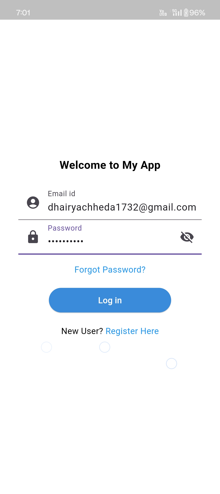
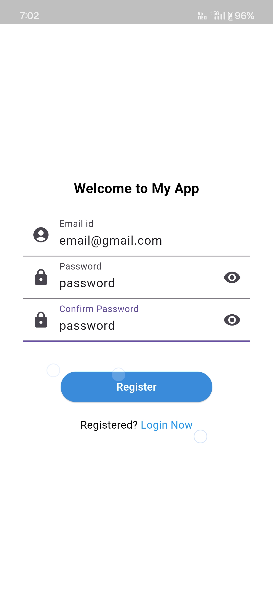
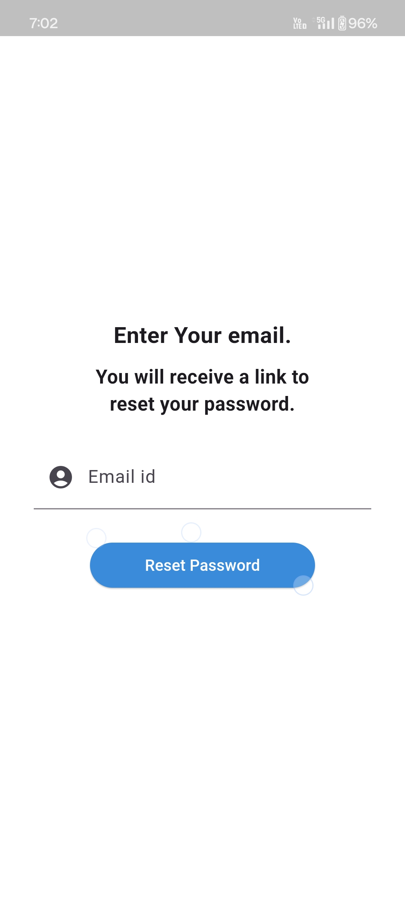
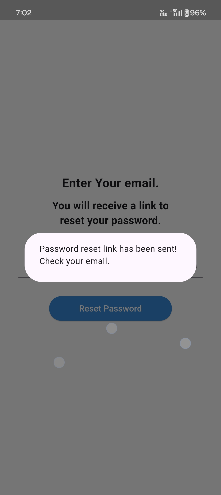

# my_login_app

A Flutter App to implement simple Sign Up,Sign In and Reset Password functionality using Firebase.

This is the Login Page.

This is the Register Page.

This is the Forgot Password Page.

This is the message shown after entering the email.

This is the Home Page.

